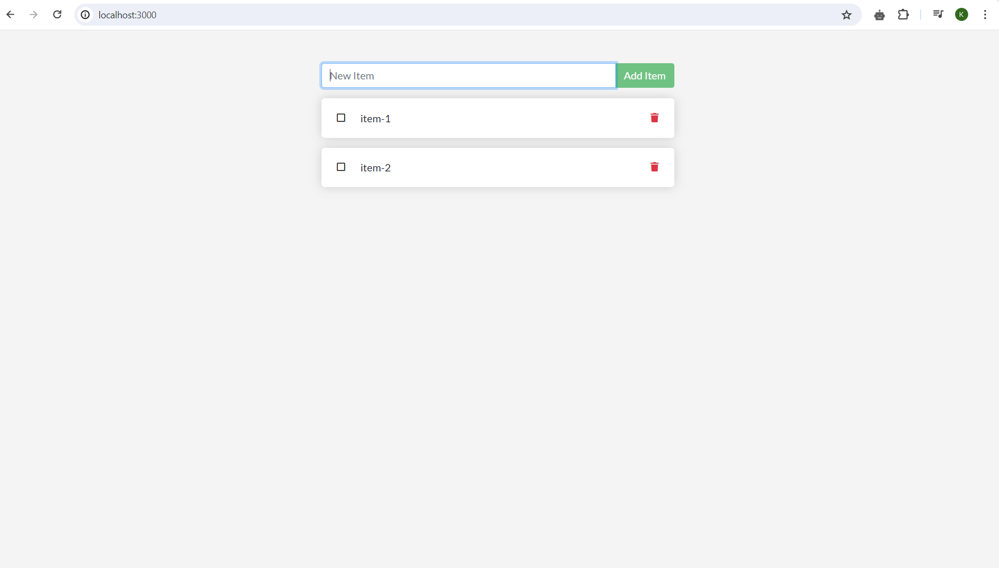

# Containerize Nodejs App

Create a new directory for node.js app

```bash
$ mkdir node.js
```

Clone the following node.js application repository to be containerized.

```bash
$ git clone https://github.com/docker/docker-nodejs-sample.git
```

Dockerfile

```docker
FROM node:18.16.0-alpine3.17

WORKDIR /app

COPY package*.json ./
RUN npm install

COPY . .

EXPOSE 3000

CMD ["node", "src/index.js"]
```

Build the Dockerfile to image

```bash
$ docker build -t nodejs-app:v1 .
```

Running Docker container

```bash
$ docker run -it --name nodjs-app -p 3000:3000 nodejs-app:v1
```

Connect the application on browser.

http://localhost:3000

